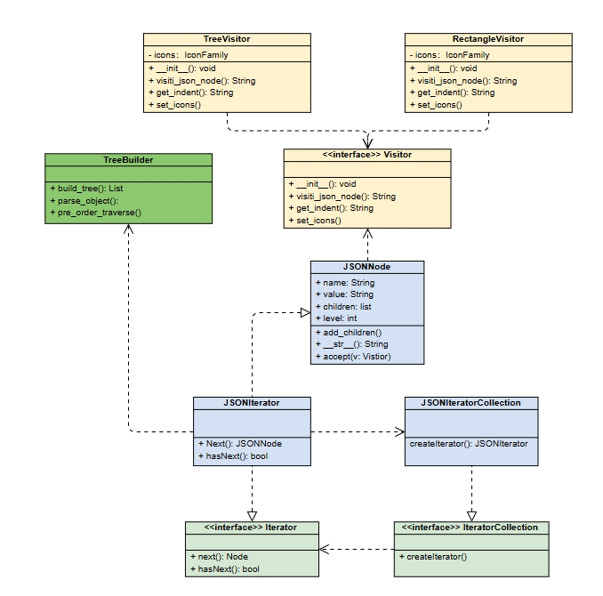
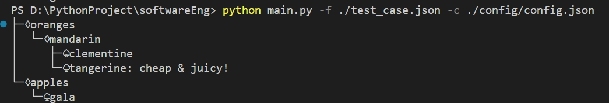
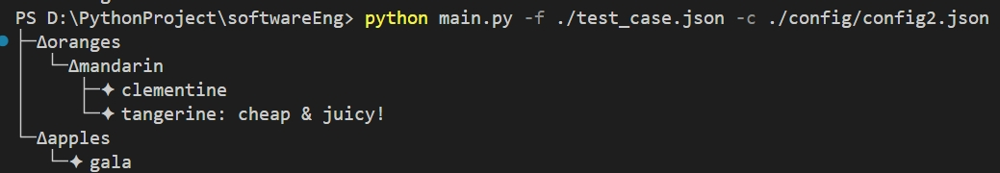
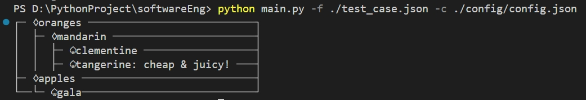
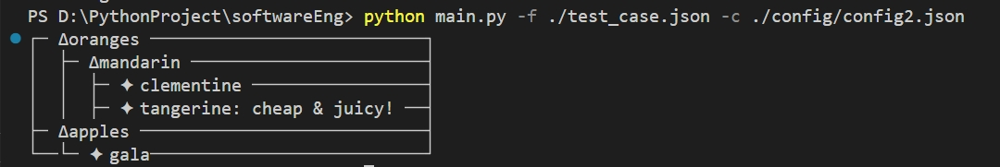

## FJE 进阶版

### 实验要求

使用迭代器模式+访问者模式实现FJE

### 类图



【解释说明】

- 迭代器模式

  迭代器模式是一种行为设计模式，提供一种方法顺序访问一个聚合对象中的各个元素，而不暴露其内部的表示。

  - `Iterator`：迭代器接口，声明遍历元素的方法。
  - `JSONIterator` : 具体迭代器类, 实现了`next()`和`hasNext()`两种迭代器方法
  - `IteratorCollection` 是迭代器集合接口，提供获取迭代器的方法
  - `JSONIteratorCollection` 是具体迭代器集合接口，其会创建并返回具体的JSONIterator

  迭代器通过使用`next`的方法按顺序遍历JSON树上的所有结点

- 访问者模式

  访问者模式是一种行为设计模式，允许将算法与操作的对象结构分离。

  JSONNode本身没有实现渲染方法，而是使用访问者对其进行渲染。具体实现了2种访问者

  - `Visitor` 是访问者接口
  - `TreeVisitor` 和 `RectangleVisitor` 是具体访问者类。二者都提供`visit_json_node`的方法，用于对某一个结点进行渲染
  - `JSONNode` 是具体元素类，它实现了 `accept` 方法，接受访问者。

- Treebuilder

  这个类实现了对JSON源输入的处理，首先字典的输入转成树形结构，然后使用后序遍历将结点按顺序方法一个数组，方便迭代器使用。

### 运行结果

本代码提供使用配置文件的方法设置图片族，配置文件的格式如下：

```
{
    "json_file": JSON_FILE_PATHPATH,
    "icon":{
        "node": "♢",
        "leaf": "♤"
    },
    "style":STYLE（'tree' or 'rectangle')
}
```

在终端输入以下命令即可运行

```shell
python main.py -c ./config/config.json
```

最终的结果如下：

- 树形结构

  - 扑克牌图标族

    

  - 自定义图标族

    

- 长方形结构

  - 扑克牌图标族

    

  - 自定义图标族

    


